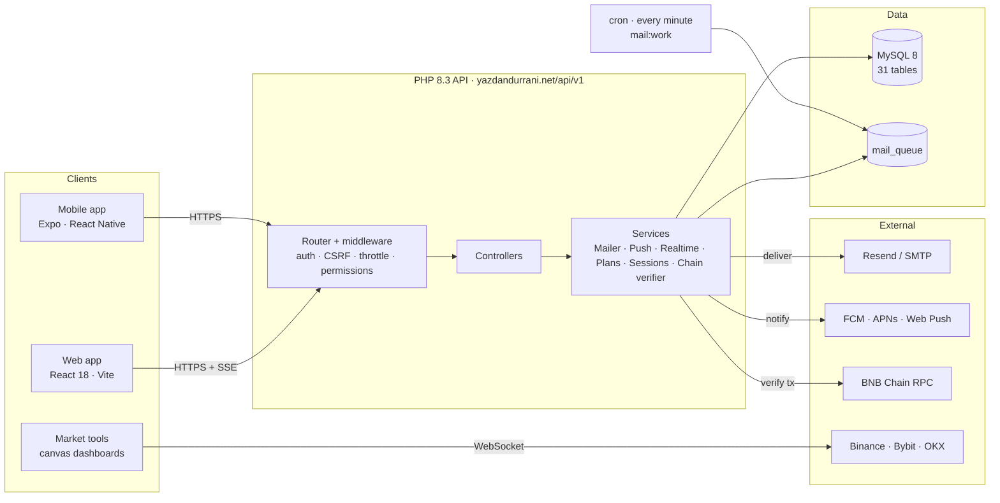
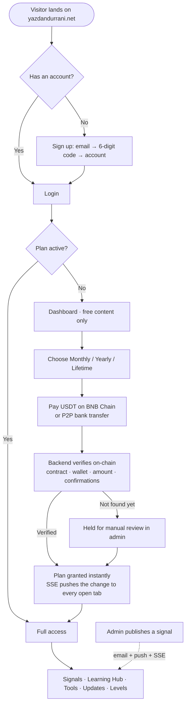
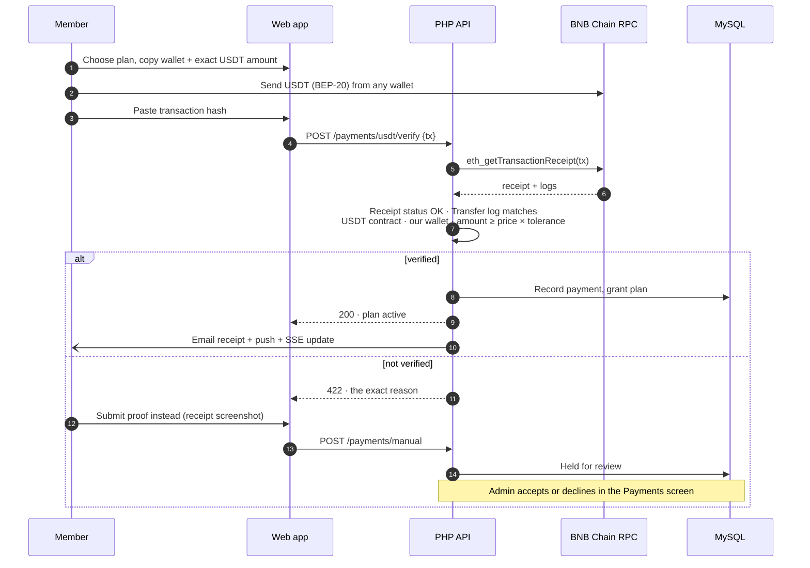
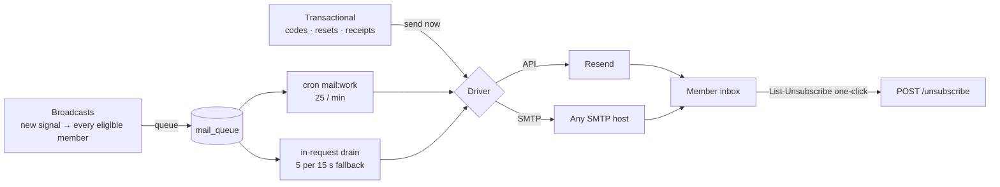

<p align="center">
  <a href="https://yazdandurrani.net">
    
  </a>
</p>

<h1 align="center">YazdanDurrani</h1>

<p align="center">
  <strong>Crypto &amp; trading education, live signals, and honest market analysis.</strong><br>
  <em>No fake promises, no overnight-millionaire talk — learn to trade smart, not blind.</em>
</p>

<p align="center">
  <a href="https://yazdandurrani.net"></a>
</p>

<p align="center">
  
  
  
  
  
  
</p>

---

## What this is

**YazdanDurrani** is a membership platform for crypto and forex traders. Members pay for a plan — monthly, yearly, or lifetime — and get access to live trade signals, a structured learning library, daily market updates, degree-based key levels, and three live market tools that draw real order-book data. Everything is published by a small admin team from a full management panel.

The platform is three things sharing one API:

| Surface | What it is | Status |
|---|---|---|
| **Web app** — [yazdandurrani.net](https://yazdandurrani.net) | Public landing page, member area, and admin panel | **Live** |
| **API** — `yazdandurrani.net/api/v1` | 131-route PHP backend behind both | **Live** |
| **Mobile app** — iOS &amp; Android | Fully native Expo / React Native app, member + admin | **In development** — see [Mobile app](#-mobile-app--ios--android) |

---

## Features

### For members

- **Live signals** — crypto futures &amp; spot, forex gold &amp; silver, with entry, targets, and stops. New signals reach every eligible member by email and push the moment they publish.
- **Learning Hub** — three levels (beginner → intermediate → advanced), unlocked by plan.
- **Strategies, Books &amp; Market Updates** — the written library, with images and voice notes from the analyst.
- **Degree-based key levels** — the calculation-based levels the analysis is built on.
- **Astrology &amp; numerology predictions** — daily BTC and gold readings via the embedded *AstraLedger* engine.
- **Three live market tools** — *Liquidity Map* (liquidation heat + order book), *Money Flow Map* (capital rotation), *News Tape* (pre-news prediction engine). Canvas dashboards on live exchange feeds, fully responsive down to 320px.
- **On-chain membership payments** — pay in USDT on BNB Chain; the backend verifies the transaction against the chain itself.
- **P2P exchange** — buy/sell USDT for PKR against the analyst's own rate, with bank transfer and receipt upload.
- **Support chat**, **web push notifications**, **install-to-home-screen**, multi-device session control, and one-click email unsubscribe.

### For admins

A complete back office at `/admin` — no database access needed for day-to-day operation:

- **Members** — search, plan grants, manual member creation with credentials, session revocation, role assignment.
- **Content** — signals, posts, books, degree levels, voice notes, testimonials, astro predictions. Rich-text editing via Tiptap.
- **Payments &amp; P2P** — on-chain verification results, manual approvals, order lifecycle.
- **Support console** — reply to members in real time.
- **Landing page editor** — every section of the public site is editable, with theme control.
- **Email suite** — SMTP or Resend delivery, a block-based template editor with brand-matched design presets, live preview, test sends with full server transcripts, and a delivery queue with retry.
- **Roles &amp; permissions**, **settings**, and a full **audit log**.

Everything is **real-time**: admin changes land on member screens instantly over Server-Sent Events, and members see plan changes, new content, and support replies without refreshing.

---

## Tech stack

| Layer | Choice | Notes |
|---|---|---|
| **Frontend** | React 18 · Vite 5 · React Router 6 | SPA served as static files; `/api` proxied in dev. Tiptap for rich text. Zero-warning ESLint. |
| **Backend** | PHP 8.3, custom framework, **no Composer** | Router, middleware pipeline, request/response, config + env loader. Runs on ordinary shared hosting. |
| **Database** | MySQL 8 · 31 tables | Plain PDO with prepared statements. Numbered SQL migrations. |
| **Auth** | JWT access tokens + rotating refresh tokens in `httpOnly` cookies | Argon2id password hashing, refresh-token-reuse detection with a grace window for racing tabs, CSRF double-submit, optional single-device login, rate-limited logins. |
| **Secrets at rest** | AES-256-GCM (`APP_KEY`) | SMTP passwords and API keys are encrypted before storage; the panel shows a fingerprint, never the value. |
| **Realtime** | Server-Sent Events with polling fallback | HMAC ticket auth, because `EventSource` can't set headers. |
| **Push** | Web Push (VAPID) over `aes128gcm`, implemented directly on OpenSSL | No third-party library. |
| **Email** | Resend API **or** raw SMTP (STARTTLS / implicit TLS) | Hand-written SMTP client: multi-line replies, dot-stuffing, RFC 2047, quoted-printable, `multipart/alternative`. Queue with cron worker + in-request fallback drain. `List-Unsubscribe` one-click. |
| **Payments** | USDT (BEP-20) on BNB Chain, verified by JSON-RPC | Reads the transfer from the chain, checks contract, wallet, amount tolerance, and confirmations. Multiple RPC endpoints for failover. |
| **Market data** | Binance / Bybit / OKX public feeds, WebSocket + REST | Consumed client-side by the three tool dashboards. |
| **Mobile** | Expo (managed) · React Native · expo-router · TanStack Query · expo-secure-store | See below. |
| **Dev environment** | Docker (`php:8.3-apache` + MySQL 8), Vite dev server | Apache with mod_php on purpose — the SSE endpoint holds connections open. |

---

## Architecture



---

## How it works

### Member journey



### On-chain payment verification



### Mail delivery



---

## Repository layout

```
.
├── frontend/                 React 18 + Vite web app
│   ├── src/pages/            Public, member, and admin pages
│   ├── src/pages/admin/      The back office (16 screens)
│   ├── src/components/       Shared UI, modals, charts
│   ├── src/context/          Auth, Realtime, Toast, Theme providers
│   ├── src/styles/           legacy-theme.css (site theme) + index.css + components.css
│   └── public/tools/         The three canvas market dashboards + AstraLedger
│
├── backend/                  PHP 8.3 API (no Composer)
│   ├── public/index.php      Front controller — the only web-reachable PHP file
│   ├── app/Core/             Router, Request/Response, Database, Env, Crypto, JWT
│   ├── app/Controllers/      Public, Auth, Member, Payment, Admin/*
│   ├── app/Services/         Mailer, SmtpClient, PushService, RealtimeService,
│   │                         SessionService, PlanService, ChainVerifier, …
│   ├── routes/api.php        All 131 routes with middleware
│   ├── config/               app · auth · mail · payments · database
│   ├── database/migrations/  Numbered SQL migrations
│   ├── console.php           CLI: mail:work · mail:test · mail:show · admin:create · …
│   └── scripts/              Dev tools — local SMTP sink, Resend stub
│
└── mobile/                   Expo / React Native app (in development)
    ├── app/(auth)/           Onboarding · Login · Sign up · Forgot password
    ├── app/(member)/         Member stack
    ├── app/(admin)/          Admin stack
    ├── src/api/ src/auth/    API client, session, secure token storage
```

---

## API overview

`https://yazdandurrani.net/api/v1` — JSON in, JSON out, `{ ok, data | error }`.

| Area | Routes | Highlights |
|---|---|---|
| Auth | `signup/*` `login` `refresh` `password/*` `sessions` | Email verification codes, rotating refresh, device list + revoke |
| Content | `signals` `posts` `degree-levels` `voice-messages` `testimonials` `astro` | Plan-gated; `auth.optional` on public reads |
| Payments | `payments/*` `p2p/*` | On-chain verification, P2P order lifecycle |
| Member | `notifications` `push` `support` `reactions` | Web push subscribe, support threads |
| Realtime | `realtime/*` | SSE stream + polling fallback |
| Mail | `unsubscribe` | Public, tokenised, `GET` and `POST` |
| Admin | `admin/members` `admin/email/*` `admin/landing/*` `admin/roles/*` … | Permission-gated per route |

Rate limits, CSRF, and permissions are declared per route in [`backend/routes/api.php`](backend/routes/api.php).

---

## 📱 Mobile app — iOS &amp; Android

A **fully native** companion app is in development in [`mobile/`](mobile/), built against the same API. It is not a wrapper around the website — every screen is React Native.

| | |
|---|---|
| **Toolchain** | Expo (managed workflow), EAS builds — no Xcode or Android Studio required; JS fixes ship over the air |
| **Navigation** | `expo-router` with route groups: `(auth)` · `(member)` · `(admin)` |
| **Data** | TanStack Query against `/api/v1`; tokens in `expo-secure-store` |
| **Identity** | `net.yazdandurrani.app` on both stores |
| **Login** | One form — the role in the response decides whether you land on the member or admin stack |
| **Push** | FCM (Android) + APNs (iOS), added to the backend alongside Web Push |
| **Market tools** | The three canvas dashboards run in a WebView, reusing the responsive web versions — the one deliberate exception to "no WebView" |

**Launch sequence**

```
  Animated logo splash  →  Get-started slides  →  Login / Sign up  →  Member or Admin dashboard
        ~1.6 s, once        first run only          role decides
```

**Planned scope: 40 screens** — 5 auth · 14 member · 3 tools · 18 admin.
**Built so far:** the auth stack (splash, onboarding, login, sign-up, forgot-password), member home, and the admin overview.

The full plan, decisions, and screen list live in [`mobile/PLAN.md`](mobile/PLAN.md).

---

## Running locally

**Prerequisites:** Docker, Node 18+.

```bash
# 1. Backend — PHP 8.3 + Apache with the repo bind-mounted, plus MySQL 8
docker build -t yd-api -f backend/Dockerfile.dev backend
docker run -d --name yd-mysql -e MYSQL_ROOT_PASSWORD=root -e MYSQL_DATABASE=yazdandurrani \
  -e MYSQL_USER=yazdan_app -e MYSQL_PASSWORD=yd_local_app -p 3306:3306 mysql:8
docker run -d --name yd-api --link yd-mysql -v "$PWD/backend:/var/www/html" -p 8000:80 yd-api

# 2. Database
cp backend/.env.example backend/.env         # then fill in DB_*, JWT_*, APP_KEY
for f in backend/database/migrations/*.sql; do docker exec -i yd-mysql mysql -uroot -proot yazdandurrani < "$f"; done
docker exec -it yd-api php console.php admin:create
docker exec     yd-api php console.php install:content

# 3. Frontend
cd frontend && npm install && npm run dev     # proxies /api → localhost:8000
```

Generate real secrets rather than using the example ones:

```bash
docker exec yd-api php console.php keys:generate   # JWT, APP_KEY, and VAPID keys
```

### Console

| Command | Purpose |
|---|---|
| `mail:work` | Drain the mail queue — run from cron every minute |
| `mail:show` | Print the effective mail config and where each value comes from |
| `mail:test you@example.com` | Send one real message and print the full SMTP/API transcript |
| `reminders:send` | Email members whose plan expires in 3 days — daily cron |
| `maintenance:run` | Purge expired sessions, tokens, rate limits, events |
| `admin:create` / `admin:password` | Bootstrap or recover an admin |
| `keys:generate` | Fresh JWT, `APP_KEY`, and VAPID keys |

### Production cron

```
* * * * *  php /path/to/backend/console.php mail:work        >> /dev/null 2>&1
0 9 * * *  php /path/to/backend/console.php reminders:send   >> /dev/null 2>&1
30 3 * * * php /path/to/backend/console.php maintenance:run  >> /dev/null 2>&1
```

Mail still flows without cron — the API drains a small batch on ordinary traffic — but cron is the reliable path.

---

## Security notes

- `backend/public/` is the only directory the web server may serve; `.env`, logs, and source live above it.
- `console.php` returns 404 to anything that isn't the CLI.
- Access tokens are short-lived (15 min member / 60 min admin); refresh tokens rotate on every use and a replayed token outside the grace window revokes the whole account.
- Passwords: Argon2id. Stored provider secrets: AES-256-GCM under `APP_KEY`. Rotating `APP_KEY` means re-entering those secrets in the admin panel.
- Every admin action is written to `audit_logs` with actor, target, and IP.
- Set `APP_ENV=production` and `APP_DEBUG=false` in production — with debug on, 500 responses include file paths.

---

## Roadmap

- [x] Web app — public site, member area, admin panel
- [x] On-chain USDT payments and P2P exchange
- [x] Real-time sync (SSE), web push, PWA install
- [x] Email suite — templates, designs, Resend/SMTP, queue, one-click unsubscribe
- [x] Responsive market tools down to 320px
- [ ] **iOS &amp; Android app** — auth stack and dashboards built; member and admin screens in progress
- [ ] FCM / APNs push delivery from the backend
- [ ] Native charting for the market tools (replacing the WebView)

---

<p align="center">
  <a href="https://yazdandurrani.net"><strong>yazdandurrani.net</strong></a><br>
  <sub>© YazdanDurrani. All rights reserved.</sub>
</p>
